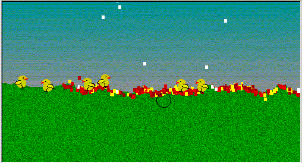



## Chickens VB

### Description

This is a VB version of a game I found on the internet somewhere. Very simply, a load of chickens run across the screen, you just click to shoot.

Did I mention that there are randomly generated, adjustable levels, where so select how bumpy they are, and wait for the fun to start (Though you'll be waiting along time =0) )

I've now put a picture here, so all you who wern't downloading this ace game can see what your missing, and increase the hit count for me.
 
### More Info
 
This game should return hours of mindless fun, when you know you should be working...

Side affects include a decrease in sympathy to fluffy things...

             |
---                |---
**Submitted On**   |2000-05-23 16:01:56
**By**             |[N/A](https://github.com/Planet-Source-Code/PSCIndex/blob/master/ByAuthor/empty.md)
**Level**          |Intermediate
**User Rating**    |5.0 (10 globes from 2 users)
**Compatibility**  |VB 4\.0 \(32\-bit\), VB 5\.0, VB 6\.0
**Category**       |[Games](https://github.com/Planet-Source-Code/PSCIndex/blob/master/ByCategory/games__1-38.md)
**World**          |[Visual Basic](https://github.com/Planet-Source-Code/PSCIndex/blob/master/ByWorld/visual-basic.md)
**Archive File**   |[CODE\_UPLOAD68286162000\.zip](https://github.com/Planet-Source-Code/chickens-vb__1-8974/archive/master.zip)

